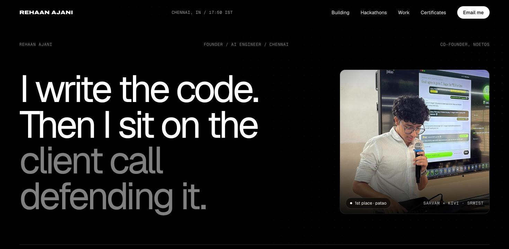

<picture>
  <source media="(prefers-color-scheme: dark)" srcset="assets/header-dark.svg">
  <source media="(prefers-color-scheme: light)" srcset="assets/header-light.svg">
  
</picture>

I co-founded [NOETOS](https://noetos.co), where we build private, context-native AI. I own the technical side end to end: architecture, build, deployment, and the client calls. Agents write a lot of the code. I review every diff.

**[Portfolio: rehaanajanime.vercel.app ↗](https://rehaanajanime.vercel.app)**

### Building

| Product | What it is | Where it is |
| :-- | :-- | :-- |
| [**TGOI**](https://tgoi.work) | The AI workspace that knows your company. Every answer cites its source and prints its cost. | 10 companies, 100+ people |
| [**MANTRA**](https://play.google.com/store/apps/details?id=com.vms.mantra) | Private personal intelligence. Learns one person's patterns, local-first. | 3,000+ users, 5.0 rated |
| [**Zuraksha**](https://zuraksha.in) | One identity code that shares your data field by field, only when you approve. | App and site in progress |

### Recently shipped

<!-- shipped:start -->
- [**TradeDesk**](https://github.com/rehaanajani/TradeDesk) · [Add screenshots of every tab to the README](https://github.com/rehaanajani/TradeDesk/commit/a09f4843a3494d7bfb7468d61979e1c8e2c7c4ca) 2 days ago
- [**TradeDesk**](https://github.com/rehaanajani/TradeDesk) · [Make the interface minimal: light only, black on white, colour just for price moves](https://github.com/rehaanajani/TradeDesk/commit/fc0e16eecc23743709941a4a37a383a3de886c6d) 2 days ago
- [**nyayamitra**](https://github.com/rehaanajani/nyayamitra) · [Put Sheru, the name and both builders on the thumbnail](https://github.com/rehaanajani/nyayamitra/commit/39412d699f3d11d3fcaf701fed0bbd24f077ff74) 2 days ago
- [**nyayamitra**](https://github.com/rehaanajani/nyayamitra) · [Let the recording rig write outside the film's folder](https://github.com/rehaanajani/nyayamitra/commit/176be60c7e1ea0628e5c40c1a70620a1a21532df) 2 days ago
- [**paalam**](https://github.com/rehaanajani/paalam) · [Test: cover reminder time validation, defaults and re-arming](https://github.com/rehaanajani/paalam/commit/f252630f72d93fdd4b3b800740ec1710b7fd2748) 8 days ago
<!-- shipped:end -->

<!-- updated:start -->
Pulled from merged pull requests and commits on public repos. Refreshed every six hours · last run 06 Nov 2026, 01:23 IST
<!-- updated:end -->

### Selected work

| Project | What it does | Result |
| :-- | :-- | :-- |
| [**SUPREME**](https://github.com/rehaanajani/Supreme_HackBLR) | Argue a landmark Supreme Court case against AI counsel. Live voice, multi-agent RAG on Qdrant. | HackBLR 2026, national finalist |
| [**Sentinel-Shield**](https://github.com/rehaanajani/Sentinel-Shield) | Deterministic security layer between autonomous AI agents and a trading API. | Ossome Hacks 3.0, runner-up |
| [**Socius**](https://github.com/solnikhil/Socius) | Open-source local agent that does the work instead of describing it. | Ideathon 3.0, 1st |
| [**patao**](https://patao.vercel.app) | Voice talking-stage simulator on Sarvam's speech stack. | Sarvam × Kivi build-a-thon, 1st |
| [**ETHRALENS**](https://github.com/rehaanajani/ETHRALENS) | GitHub Action that fails CI when a contract is too expensive for its users. | Published Action |
| [**Dental PMS**](https://github.com/rehaanajani/Dental-PMS) | Offline-first clinic system in Gujarati, in daily use at a practising clinic. | Commissioned |

### Stack

`TypeScript` `Python` `Java` `React` `Next.js` `React Native` `FastAPI` `Spring Boot` `Postgres` `Supabase` `Qdrant` `MCP` `AWS Bedrock`

---

[Portfolio](https://rehaanajanime.vercel.app) · [LinkedIn](https://www.linkedin.com/in/rehaan-ajani) · [noetos.co](https://noetos.co) · [rehaanajani123@gmail.com](mailto:rehaanajani123@gmail.com)

